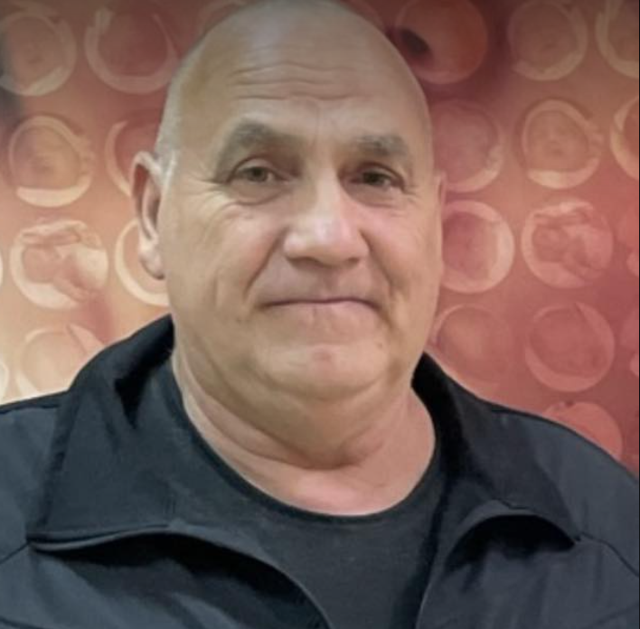

# Georgi Stoyanov Lazarov

    

        # Georgi Stoyanov Lazarov

        **Date of Birth:** 09.01.1966
        **Place of Birth:** Straldzha, Bulgaria
        - **Phone:** 0895410131
        - **Email:** georgi_lazarov1966@mail.bg
    

    
 <!-- Adjust the margin as needed -->
        
    

---

### Profile

Dedicated and skilled professional with a background in electrical engineering. A team player with strong communication skills and proficiency in both Bulgarian and Russian languages. Experienced in the field of electrical technology and a commitment to delivering high-quality results. Worked as a contractor in Germany for several years, which has provided me with valuable international experience and a deep understanding of the electrical industry in a diverse and demanding environment. This experience has further honed my technical skills and the ability to adapt to different work settings, making me a versatile and dependable professional.

### Education

- Graduated from the Communications Technical High School in Shumen, Bulgaria (1984)
- **Specialization:** Electrical Technician

### Work Experience

**El Nova LTD, Stara Zagora**
- **Position:** Electrical Technician

**Responsibilities:**
- Conducted electrical installations, maintenance, and repairs, ensuring the efficient operation of electrical systems and equipment.
- Collaborated effectively with a diverse team, both locally and in international settings, to ensure a smooth workflow, fostering a cooperative and productive work environment.
- Demonstrated excellent problem-solving skills, diagnosing and resolving complex electrical issues efficiently, which led to minimized downtime and increased productivity.
- Ensured strict compliance with safety standards and regulations, implementing and promoting a safety-first culture on-site. Conducted safety training for team members and actively participated in safety inspections, maintaining an impeccable safety record.
- Managed project timelines and budgets, ensuring projects were completed on time and within budget constraints.
- Coordinated with clients to understand their specific electrical requirements and provided tailored solutions that met or exceeded their expectations.
- Trained and mentored junior electrical technicians, sharing expertise and fostering their professional development.
- Conducted regular inspections and maintenance to prevent equipment failures and improve overall system reliability.
- Stayed up-to-date with the latest developments in electrical engineering and technology to apply innovative solutions to projects.
- Played a key role in problem-solving and troubleshooting complex electrical issues, contributing to the success of various projects.

### Languages

- Bulgarian: Native proficiency
- Russian: Excellent/Bilingual proficiency

### Additional Skills

- **Driver's License:** Category B
- Proficient in various electrical tools and equipment.
- Strong analytical and technical skills in the field of electrical engineering.

### References

Available upon request.
