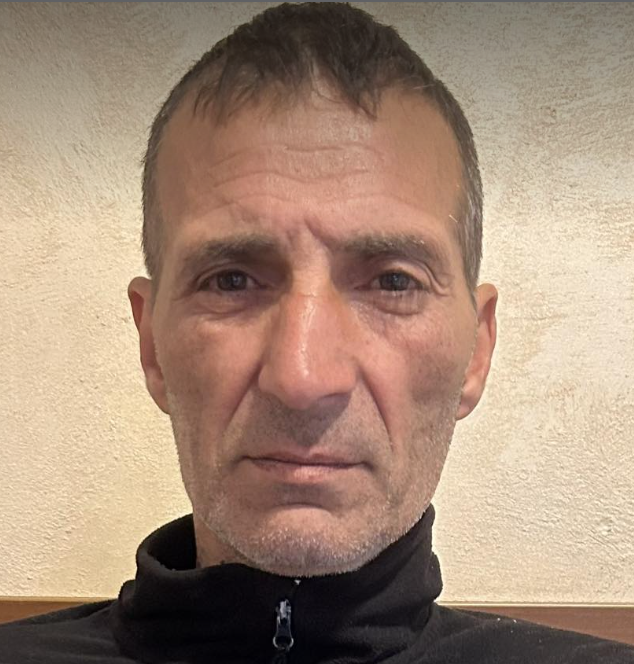

# Curriculum Vitae

# Ivan Jovchev Ivanov

| Picture | Data of Birth | Residence | Phone Number | email |
| --- | --- | --- | --- | --- |
|   | 1975 | Straldzha, Bulgaria | 0894052483 | ivaniovchev610@gmail.com |

## Education

- **Secondary School:** Technical School
  - Specialization: Electrician

## Work Experience

### Freelance Electrician (Years of Experience: 2000 - Present)

- **Responsibilities:**
  - Repairing and fixing electrical appliances
  - Wiring houses and commercial buildings
  - Conducting inspections to identify electrical issues
  - Providing consultations on electrical systems

- **Key Achievements:**
  - Successfully completed numerous electrical projects independently.
  - Developed a reputation for reliability and quality service.

## Skills

- **Electrical Expertise:**
  - Proficient in diagnosing and repairing electrical issues.
  - Skilled in wiring residential and commercial properties.

- **Problem-Solving:**
  - Proven ability to troubleshoot and solve electrical problems efficiently.

- **Customer Service:**
  - Excellent communication skills, ensuring customer satisfaction.

## Languages
 - Turkish
 - Bulgarian
